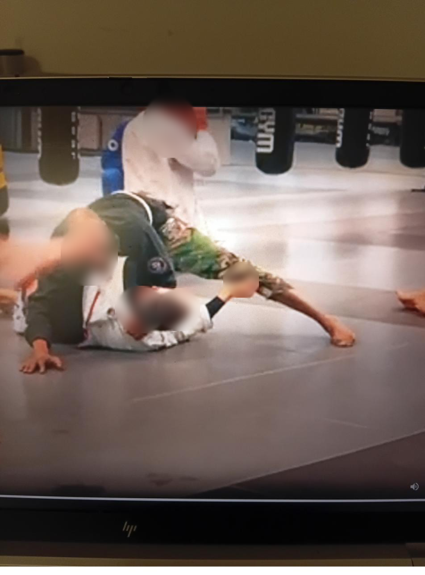

# Modified Canto Choke Evidence Visuals

Face-blurred evidence visuals for the Modified Canto Choke / Purple Belt archive sequence.

## Main Archive Image

## Purpose

This folder contains selected visual evidence from a training sequence used to document technique development, archive-to-mat transfer, and applied learning.

The visuals are included for portfolio and evidence-context purposes only.

## Privacy Note

Facial features have been blurred before public release. These visuals do not include the raw source video or unblurred screenshots.
