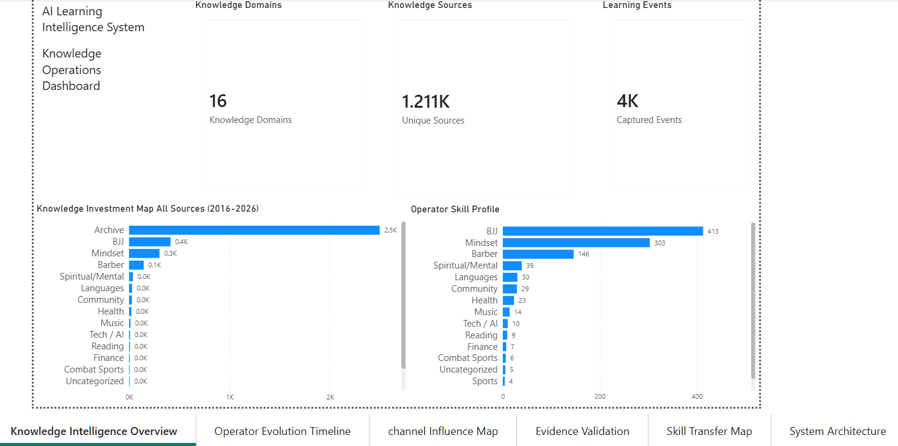
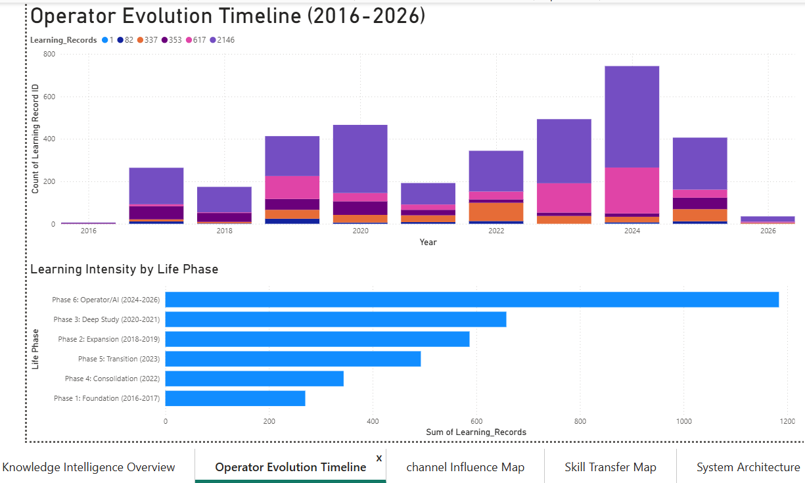
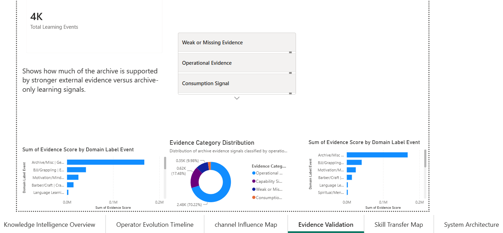
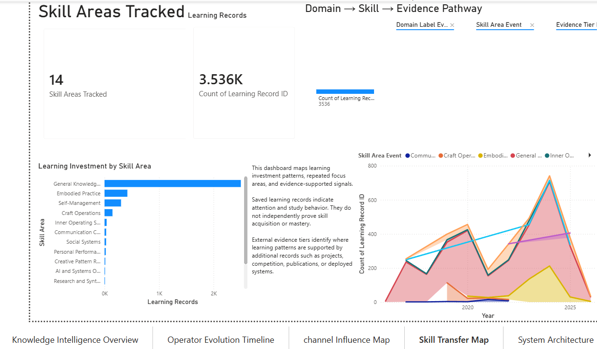
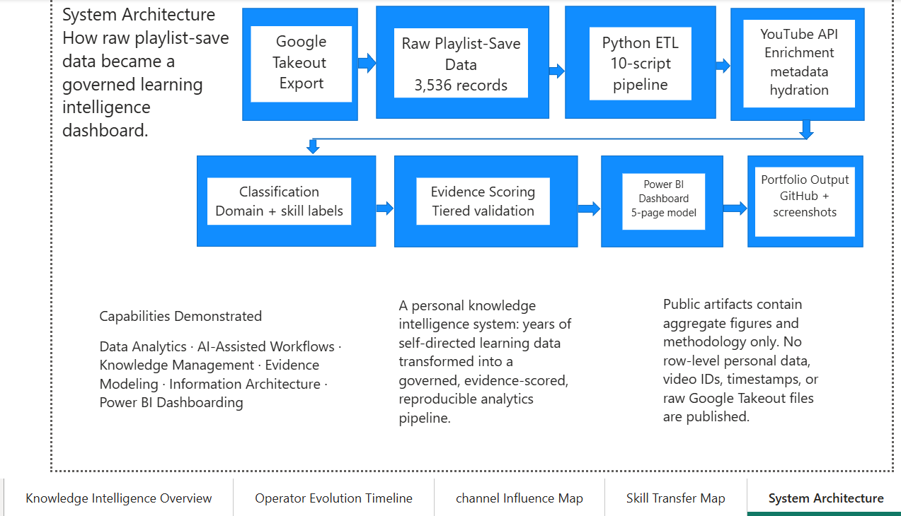

# YouTube Learning Archive dashboard

The Power BI layer presents aggregate outputs from the YouTube Learning Archive Intelligence System. The private `.pbix` model and all row-level source data remain outside this repository.

Screenshot verification here means that a readable, non-placeholder export is tracked and visually corresponds to the named page. It does not independently prove that the export matches the latest private Power BI model.

## Evidence status

| Page | Public screenshot | Verification status | Privacy status | Notes |
|---|---|---|---|---|
| 1. Knowledge Intelligence Overview | [`knowledge_intelligence_overview.png`](screenshots/knowledge_intelligence_overview.png) | Verified export | Aggregate only | Current export shows all six page tabs. |
| 2. Operator Evolution Timeline | [`operator_evolution_timeline.png`](screenshots/operator_evolution_timeline.png) | Verified export; currency limited | Aggregate only | Readable page export; its navigation bar predates the Evidence Validation page. |
| 3. Channel Influence Map | Not supplied | Missing public evidence | Not reviewable | The former 1x1 placeholder was removed. A genuine export must be supplied manually. |
| 4. Evidence Validation Dashboard | [`evidence_validation_dashboard.png`](screenshots/evidence_validation_dashboard.png) | Verified export | Aggregate only | Readable export titled “Evidence Validation” in the dashboard. |
| 5. Skill Transfer Map | [`skill_transfer_map.png`](screenshots/skill_transfer_map.png) | Verified export; currency limited | Aggregate only | Readable page export; its navigation bar predates the Evidence Validation page. |
| 6. System Architecture | [`system_architecture.png`](screenshots/system_architecture.png) | Verified export; content stale | Aggregate only | The image still says “5-page model” and “10-script pipeline”; the public repo documents six pages and contains six numbered analysis scripts plus the runner. |

## 1. Knowledge Intelligence Overview

**Purpose:** Summarizes the distribution of saved records across knowledge domains, sources, and operator-oriented skill groupings.

**Question answered:** Which classified domains and sources account for the largest share of archive activity?

**Employer relevance:** Demonstrates compact KPI design, categorical aggregation, and clear portfolio framing while keeping row-level records private.



## 2. Operator Evolution Timeline

**Purpose:** Places playlist-save activity on a year and life-phase timeline.

**Question answered:** When did collection activity change, and which defined phases contain the highest volume?

**Employer relevance:** Shows temporal modeling and the ability to translate engineered date features into an interpretable analytical view.

> **Evidence status:** The page export is genuine and readable, but its five-tab navigation indicates that it predates the added Evidence Validation page.



## 3. Channel Influence Map

**Purpose:** Intended to identify recurring knowledge sources and their persistence over time.

**Question answered:** Which channels recur most often within the saved-video archive?

**Employer relevance:** Would demonstrate source-level aggregation and network-style influence analysis without exposing individual video records.

> **Evidence status:** The dashboard page is documented, but a valid public screenshot has not yet been supplied. The previous file was a 1x1-pixel placeholder and is not presented as evidence.

## 4. Evidence Validation Dashboard

**Purpose:** Separates archive-only collection signals from stronger external or operational evidence categories.

**Question answered:** How is the available evidence distributed across the project’s validation tiers?

**Employer relevance:** Demonstrates evidence governance and explicit handling of the difference between behavioral signals and demonstrated capability.



## 5. Skill Transfer Map

**Purpose:** Maps classified domains to skill-area and evidence-tier concepts while stating the limits of inference.

**Question answered:** Which skill areas are associated with repeated archive activity, and where does separate evidence exist?

**Employer relevance:** Shows semantic modeling and responsible communication of proxy measures.

> **Evidence status:** The page export is genuine and readable, but its five-tab navigation indicates that it predates the added Evidence Validation page.



## 6. System Architecture

**Purpose:** Explains the intended flow from private export through enrichment, classification, evidence scoring, and public artifacts.

**Question answered:** How does private source material become a governed public portfolio package?

**Employer relevance:** Demonstrates systems thinking, privacy boundaries, and communication of an end-to-end data workflow.

> **Evidence status:** The screenshot is a genuine, readable export, but two labels are stale: “5-page model” and “10-script pipeline.” Treat it as a historical architecture export until a corrected page is supplied from the private Power BI file.



## Supplying the missing export

Export the actual Channel Influence Map page from the private Power BI file, confirm that it contains no row-level personal data, save it as `screenshots/channel_influence_map.png`, and rerun:

```bash
python Scripts/validate_public_release.py
```

Do not generate a substitute image or reconstruct the private model from excluded data.

